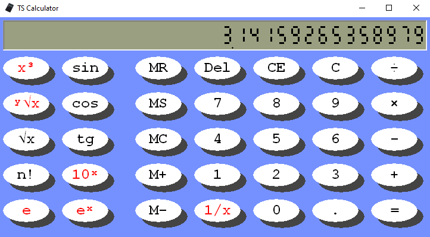

# TS Calculator
A desktop calculator application made in C++ and win32 API. **Download is [here](https://github.com/tstamborski/calculator/releases/download/v1.0.2/Calculator.exe).**

Below you can see the screenshots. BTW: some functions of calculator are hidden under holding shift key. You can also show and hide some buttons by maximizing
window (like on the Mac OS X).

It is the same application which i published many years ago on CodePlex (not existing now) - It was my first finished and working (and maybe even useful)
program, so it is important souvenir for me, to keep it here. 
